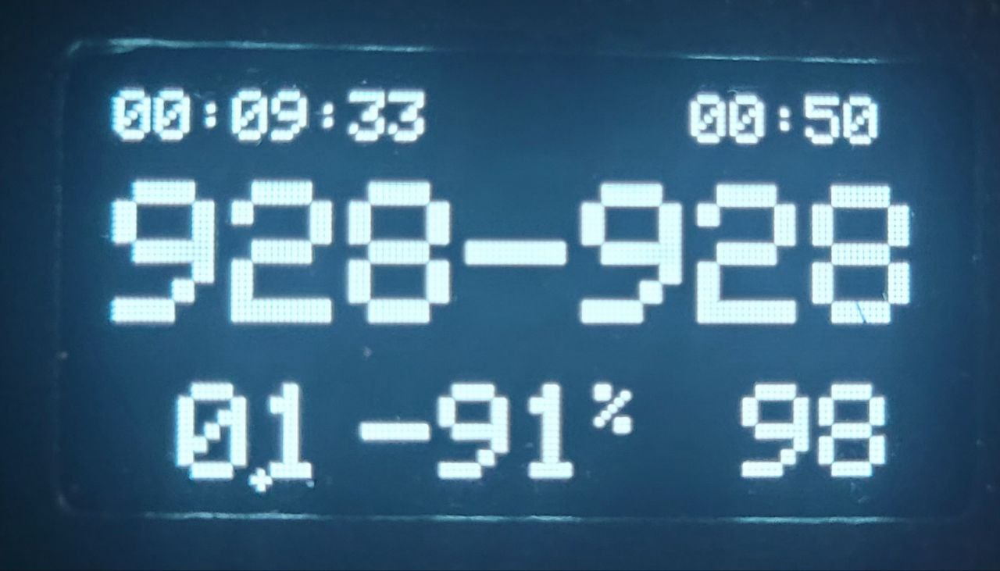
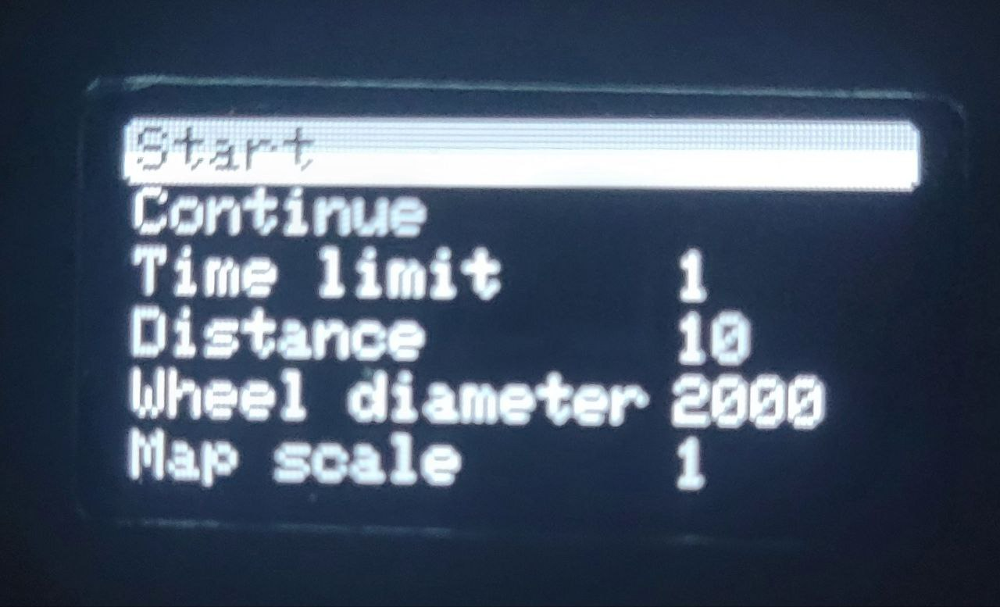

# velo

A simple project to test the Arduino Nano ATmega328 board. Used for velo run tracking.

## Getting Started

### Required Software

* [PlatformIO](https://platformio.org/platformio-ide)

The PlatformIO IDE is an extension for VSCode and can be used on all platforms. It is written in Python and makes use of a cross-platform build system to work on all major operating systems.

It allows to build/upload the code to the board, debug it and read the serial output from the board.

### Hardware

Arduino Nano, OLED 1.30" 128x64 I2C display, reed switch, buttons.

Pinout:
* Buttons - D12, D11, D10, D9
* Reed switch - D2
* OLED - SDA - A4, SCL - A5

### Structure

The project is structured as follows:

* `include` - header files
* `src` - source files
* `lib` - external libraries
* `platformio.ini` - project configuration file

### Used external Libraries
Libraties for displaying the run data on the screen.

* [Adafruit GFX Library](https://github.com/adafruit/Adafruit-GFX-Library)
* [Adafruit SH1106 Library](https://github.com/adafruit/Adafruit_SH1106)
* [Adafruit BusIO](https://github.com/adafruit/Adafruit_BusIO)
* [Adafruit GFX Library](https://github.com/adafruit/Adafruit-GFX-Library)

### Include files

* `display.h` - functions used to display both frames (parameters and run)
* `input.h` - contains buttons handlers same as reed switch callback used for handling the input
* `state.h` - controls current frame and main variables like passed distance, lap distance etc.
* `run.h` - run functionsused to compute current passed distance based on interrupts counter
* `const.h` - some constants used in parameters screen like number of map scale row, number of time limit row etc.
* `storage.h` - functions used to save and load parameters from EEPROM
* `algorithms.h` - contains clamp function used to clamp the value between min and max

### Source files
* `main.cpp` - contains setup and main loop function

## Screens

### Run screen



* The run screen is divided into tree rows.
First row shows elapsed time and time remaining.

Second row shows distance passed since last lap in meters and cm. If **value is bigger than 1000** then it is shown in kilometers, same for scaled value.

Third row shows total distance passed, remaining distance and percentage.

The percentage is calculated based on the total distance passed and the desired mean speed.
The formula is:

```
percentage = clamp(100 * total distance passed / desired mean speed, -100, 100)
```

The clamp function is used to clamp the value between -100 and 100.


### Parameters screen



The parameters screen has the following rows:

* Start row
* Continue row
* Time limit row
* Total distance row
* Wheel diameter row
* Map scale row

The row contains the following elements:

* A text label
* A value label

The value can be changed by using the up and down buttons on the right side of the screen.

To scroll between the rows, use the up and down buttons on the left side of the screen.

The values will be saved when user changes frame from parameters to run.

